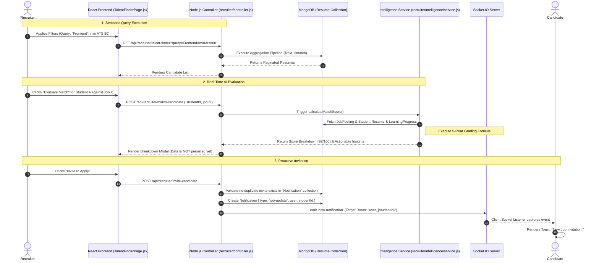

# Recruiter Module

The Recruiter Module is a paradigm-shifting suite of features designed to flip the traditional hiring model. Instead of posting a job and passively waiting for applicants, the platform provides proactive talent discovery, comprehensive job management, and an incredibly robust AI-driven candidate intelligence matching pipeline. It empowers recruiters to find the best talent instantly and evaluate applicants using a deterministic, multi-dimensional scoring system.

This document serves as the exhaustive technical reference for the Recruiter Module's architecture, AI pipelines, aggregation queries, and real-time socket integrations.

---

## 1. High-Level System Architecture & Component Interactions

The Recruiter Module operates at the intersection of search engine mechanics and predictive AI scoring.

### Architectural Pillars
1. **Search Engine (MongoDB Aggregation)**: The backend utilizes MongoDB's native `$text` indexing and complex Aggregation Pipelines to perform highly efficient semantic searches over thousands of global Resumes in real-time.
2. **Intelligence Evaluator (Node.js)**: A dedicated `recruiterIntelligence` service that calculates a 5-pillar Match Score. Crucially, this score is *not* entirely generated by an LLM (to avoid hallucinations); it is a deterministic mathematical formula blending hard database metrics with LLM semantic analysis.
3. **Real-Time Notification Pipeline (Socket.IO)**: Bridges the Recruiter UI and the Student UI. When a Recruiter clicks "Invite", a targeted WebSocket emission traverses the network to instantly alert the candidate.

---

## 2. Sub-Module Deep Dive: The Talent Discovery Workflow

This workflow maps out how a recruiter discovers a candidate, runs a real-time AI evaluation, and invites them to apply.

### The Search & Invite Sequence



### Technical Implementation Details

#### 1. The Search Mechanics (MongoDB Aggregation)
The `Talent Finder` relies on a complex MongoDB aggregation pipeline rather than simple `find()` queries. This allows us to sort by relevance (text score) while simultaneously filtering by nested array metrics.

```javascript
// server/src/modules/recruiter/controller.js (Simplified)
const pipeline = [];

// Step 1: Text Search (if query provided)
if (searchQuery) {
  pipeline.push({ 
    $match: { $text: { $search: searchQuery } } 
  });
  pipeline.push({ 
    $sort: { score: { $meta: "textScore" } } 
  });
}

// Step 2: Skill Domain Mapping
// The UI maps "Frontend" to an array of specific skills.
if (domain === 'Frontend') {
  pipeline.push({
    $match: {
      "skills.name": { 
        $in: [/react/i, /vue/i, /javascript/i, /css/i] 
      }
    }
  });
}

// Step 3: Experience Extraction
// Since "Experience" is not a hard integer in the schema, we use regex to extract graduation years.
if (experience === 'Experienced') {
  pipeline.push({
    $match: {
      "education.endDate": { $regex: /^(19|20)\d{2}/ },
      // Mathematical logic ensuring graduation year < currentYear - 3
    }
  });
}

const candidates = await Resume.aggregate(pipeline);
```

#### 2. Candidate Invitation Routing & Security
When the invitation is sent, it must traverse the WebSocket network securely. We do not use global broadcasts.
When any user logs into the platform, the Socket server automatically forces them to join a secure room matching their UUID.

```javascript
// Server-side Socket connection logic
io.on("connection", (socket) => {
  // socket.user is populated by JWT middleware
  socket.join(`user_${socket.user._id}`);
});

// Recruiter Controller - Dispatching the invite
const sendInvite = async (candidateId, jobPayload) => {
  const io = getSocketIOInstance();
  io.to(`user_${candidateId}`).emit('new-notification', jobPayload);
};
```

---

## 3. Sub-Module Deep Dive: AI Intelligence Matching Pipeline

When a student formally applies, or when a recruiter clicks "Evaluate", the `recruiterIntelligence` service calculates a deterministic Match Score out of 100.

### The 5-Pillar Mathematical Formula

`finalScore = (ATS × 0.20) + (Skills × 0.35) + (Projects × 0.25) + (Career × 0.10) + (Contributions × 0.10)`

This formula ensures the AI cannot hallucinate a good score for a candidate lacking hard skills.

1. **ATS (20%)**: Checks the overall structure, keyword density, and formatting of the student's `Resume` document.
2. **Skills (35%)**: A direct array intersection check. `JobPosting.skills` vs `Resume.skills`.
3. **Projects (25%)**: Semantic evaluation of project descriptions against the job role using an LLM.
4. **Career (10%)**: Extracted from `LearningProgress.overallProgress` (tracks Roadmaps and Mock Interview completion).
5. **Contributions (10%)**: Extracted from `LearningProgress.readinessBoost` (tracks verified open-source PRs).

### Handling Edge Cases (Data Imputation)
What if a candidate has an amazing Resume, but has never used the platform's Mock Interview feature (thus lacking `Career` metrics)?
To prevent the candidate from being penalized with a `0` for that pillar, the system implements **Baseline Imputation**. If `LearningProgress` is null, the formula distributes the 20% weight of Career/Contributions across the ATS, Skills, and Projects pillars, adjusting their relative weights automatically.

### Automated Hiring Signals
In addition to the raw score, the AI generates actionable "Hiring Signals" (color-coded tags displayed on the applicant card):
- **Fast-Track Candidate**: Automatically applied if `finalScore >= 85`.
- **Growth Potential Candidate**: Applied if the `Skills` score is low, but `Contributions` score is exceptionally high.
- **ATS Optimization Needed**: Applied if the overall score is high, but the `ATS` pillar score is `< 50`.

---

## 4. Exhaustive Database Models

### A. JobPosting Schema (`server/src/database/models/JobPosting.js`)

Tracks the requirements and metadata of a job role.

```json
{
  "_id": "ObjectId",
  "recruiter": "ObjectId (ref: User)",
  "title": "Senior Frontend Engineer",
  "company": "TechNova Inc.",
  "location": "Remote",
  "jobLevel": "Senior", // Entry, Mid, Senior, Lead
  "description": "We are looking for...",
  "skills": ["react", "typescript", "graphql", "tailwind"], // Auto-lowercased
  "salary": {
    "min": 120000,
    "max": 160000,
    "currency": "USD"
  },
  "isActive": true,
  "createdAt": "ISODate"
}
```
*Indexing*: Includes `{ title: "text", description: "text" }` to allow candidates to easily search the global job board.

### B. JobApplication Schema (`server/src/database/models/JobApplication.js`)

Tracks a candidate's application and persists the AI evaluation snapshot so it does not need to be recalculated on every page load.

```json
{
  "_id": "ObjectId",
  "job": "ObjectId (ref: JobPosting)",
  "applicant": "ObjectId (ref: User)",
  "resumeAtTimeOfApplication": "ObjectId (ref: Resume)",
  "status": "pending", // pending, reviewed, rejected, accepted
  "aiMatchScore": 88.5,
  "matchCategory": "excellent", // excellent, moderate, weak
  "aiRecruiterInsights": [
    "Candidate possesses 4 out of 4 required skills.",
    "Strong project experience utilizing React."
  ],
  "aiWeaknesses": [
    "No explicit mention of GraphQL caching strategies."
  ],
  "aiHiringSignals": ["Fast-Track", "High Open-Source Contributor"],
  "appliedAt": "ISODate"
}
```

---

## 5. Comprehensive API Endpoints Contract

### Jobs REST API (`/api/jobs`)

| Method | Endpoint | Description | Auth | Request Payload | Response |
| :--- | :--- | :--- | :--- | :--- | :--- |
| `POST` | `/` | Create a new job posting | Recruiter | `{ title, skills, salary... }` | `201 Created`: `{ jobPosting }` |
| `GET` | `/recruiter` | List recruiter's owned jobs | Recruiter | - | `200 OK`: `[ { jobs } ]` |
| `GET` | `/:id/applications`| List applicants | Recruiter | `?sortBy=score` | `200 OK`: `[ { jobApplications } ]` |

### Talent & Intelligence REST API (`/api/recruiter`)

| Method | Endpoint | Description | Auth | Request Payload | Response |
| :--- | :--- | :--- | :--- | :--- | :--- |
| `GET` | `/talent-finder` | Search global Resumes | Recruiter | `?query=react&experience=mid` | `200 OK`: `[ { sanitizedResumes } ]` |
| `POST` | `/match-candidate` | Real-time AI evaluation | Recruiter | `{ studentId, jobId }` | `200 OK`: `{ aiMatchScore, insights }` |
| `POST` | `/invite-candidate`| Trigger Socket.IO Invite | Recruiter | `{ studentId, jobId }` | `201 Created`: `{ success: true }` |

### Detailed Socket.IO Event Payloads

| Event Name | Direction | Payload Example | Description |
| :--- | :--- | :--- | :--- |
| `new-notification` | Server → Client | `{ type: "job-update", title: "New Invite!", body: "TechNova invited you...", link: "/jobs/123" }` | Emitted strictly to the `user_{candidateId}` room. Caught by the global `SocketNotificationListener`. |

---

## 6. Directory & Key Files Reference

To quickly navigate the codebase for Recruiter features:

**Frontend Components (`client/src/modules/recruiter-jobs/`)**
- `pages/RecruiterJobsPage.jsx` - Main dashboard listing active job postings.
- `pages/RecruiterApplicantsPage.jsx` - Applicant tracking view (Kanban or List view). Uses color-coded Semantic Badges to highlight the `matchCategory`.
- `pages/TalentFinderPage.jsx` - UI for the proactive candidate discovery and manual triggering of the AI evaluation modal.
- `components/JobPostingForm.jsx` - Form capturing the job schema, featuring complex validation (ensuring Salary Max >= Min).

**Backend Services (`server/src/modules/`)**
- `jobs/controller.js` & `jobs/service.js` - CRUD operations for `JobPosting` and applicant retrieval.
- `recruiter/controller.js` - Contains the massive MongoDB Aggregation Pipelines for the Talent Finder search and handles the invitation validation logic.
- `recruiterIntelligence/service.js` - The deterministic AI mathematical engine orchestrating the 5-pillar Match Score.
- `coverLetters/service.js` - Secondary AI service utilized by the Student when applying to a Recruiter's job, generating personalized text.
