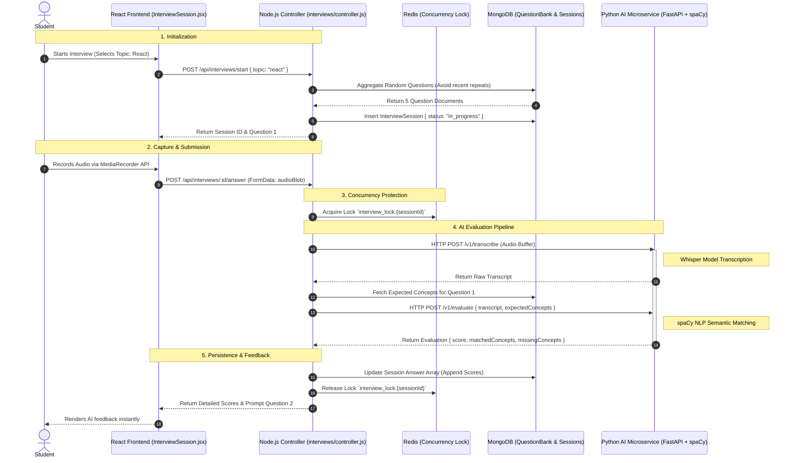

# Student Module

The Student Module is the core, comprehensive suite of features designed to help learners track their educational progress, prepare for technical interviews, build dynamic skill roadmaps, and ultimately apply for jobs. It acts as the central hub for the student persona, integrating tightly with the **Resume Analyzer** and the **Recruiter Intelligence** pipelines to create a seamless journey from learning to hiring.

This document serves as the exhaustive technical reference for the Student Module's architecture, data flows, and sub-system integrations.

---

## 1. High-Level System Architecture & Component Interactions

The Student Module is not a monolith; it is an orchestration of several microservices, real-time socket connections, and caching layers.

### Architectural Pillars
1. **The React Frontend (`client/src/modules/student-*`)**: A highly interactive, Single Page Application interface heavily utilizing React hooks for media capture (audio for interviews) and complex state management (roadmap graphs).
2. **The Node.js Backend (`server/src/modules/`)**: The primary API gateway handling authentication, database reads/writes, and business logic orchestration.
3. **The Python AI Evaluator**: A dedicated microservice utilizing `spaCy` and `sentence-transformers` for deep NLP evaluation of interview answers.
4. **Redis Cache & Concurrency Lock**: Utilized to prevent race conditions during high-latency operations (like processing audio files).
5. **MongoDB Aggregation Pipeline**: Used extensively for calculating real-time dashboard metrics across disparate collections.

---

## 2. Sub-Module Deep Dive: The Mock Interview Workflow

The Mock Interview system is the most technically complex feature within the Student Module, requiring real-time audio processing and synchronous AI evaluations.

### The Lifecycle Sequence



### Technical Implementation Details

#### 1. Audio Capture (Frontend)
To minimize payload size, audio is captured using the browser's native `MediaRecorder` API, compressed, and chunked. If the browser lacks support or the user denies microphone permissions, a graceful fallback to a standard text `<textarea>` is provided.

```javascript
// client/src/modules/mock-interview/hooks/useAudioRecorder.js
const startRecording = async () => {
  try {
    const stream = await navigator.mediaDevices.getUserMedia({ audio: true });
    mediaRecorder.current = new MediaRecorder(stream, { mimeType: 'audio/webm' });
    
    mediaRecorder.current.ondataavailable = (event) => {
      if (event.data.size > 0) audioChunks.current.push(event.data);
    };
    
    mediaRecorder.current.start();
  } catch (err) {
    handleFallbackToTextMode(err);
  }
};
```

#### 2. Concurrency Locking (Backend)
Because the Python AI service might take 5-10 seconds to transcribe and evaluate an answer, a frustrated user might click the "Submit" button multiple times. Without locking, this would result in duplicate answers being pushed to the MongoDB array, corrupting the session index.

```javascript
// server/src/modules/interviews/service.js
export const processAnswer = async (sessionId, audioBuffer, questionId) => {
  const lockKey = `interview_lock:${sessionId}`;
  const isLocked = await redisClient.set(lockKey, "LOCKED", "NX", "EX", 15);
  
  if (!isLocked) {
    throw new AppError("A submission is already processing for this session.", 429);
  }

  try {
    // ... proceed with AI calls and DB updates
  } finally {
    await redisClient.del(lockKey); // Always release the lock
  }
};
```

#### 3. Fail-Soft AI Mode
The Python AI microservice represents a potential single point of failure. If the service is unreachable or times out, the backend initiates a "Fail-Soft" mode. It assigns a placeholder score (e.g., 0 or a baseline pass) and flags the answer with `aiError: true`. This allows the student to finish the interview uninterrupted, while alerting the Tutor that manual grading is required.

---

## 3. Sub-Module Deep Dive: Dynamic Learning Roadmaps

The Learning Roadmaps module transforms static skill lists into interactive, gameified Directed Acyclic Graphs (DAGs).

### Data Flow Integration
The Roadmap is not an isolated feature; it is deeply integrated with the **Resume Analyzer**.
1. When a student uploads a new resume, the Analyzer identifies `criticalGaps` (e.g., "Missing State Management experience").
2. The `POST /api/roadmap/sync` endpoint is automatically triggered in the background.
3. These missing skills are appended as new, required milestones on the student's `LearningProgress` roadmap.

### Progression Tracking Algorithm
A student's "Readiness Score" is not a simple percentage. It utilizes a weighted calculation combining standard learning milestones and verified contributions.

```javascript
// server/src/database/models/LearningProgress.js - Pre-Save Hook
learningProgressSchema.pre('save', function (next) {
  const totalNodes = this.roadmap.length;
  if (totalNodes === 0) return next();

  // 1. Calculate base completion
  const completedNodes = this.roadmap.filter(n => n.status === 'completed').length;
  this.overallProgress = Math.round((completedNodes / totalNodes) * 100);

  // 2. Calculate contribution boost (Virtual)
  // Every merged PR or verified open-source contribution adds a +5% modifier to their Readiness Score
  const contributionNodes = this.roadmap.filter(n => n.type === 'contribution' && n.status === 'completed').length;
  this.readinessBoost = Math.min(contributionNodes * 5, 20); // Capped at 20%

  next();
});
```

---

## 4. Sub-Module Deep Dive: Dashboard & Job Application

### Dashboard Aggregation
The `StudentDashboard.jsx` provides a unified heads-up display. To achieve this without making 5 separate API calls, the backend utilizes an Aggregation Pipeline to merge data.

The `/api/dashboard/student-metrics` endpoint aggregates:
- The `overallScore` of the most recent active `Resume`.
- The `overallProgress` and `readinessBoost` from `LearningProgress`.
- The moving average of the last 5 `InterviewSession` scores.

### The Job Application Workflow
When a student views a job board (`JobBoard.jsx`), the system provides instant feedback on their suitability.

1. **Semantic Job Matching**: Before applying, the `Job Matcher` service compares the student's active resume against the `JobPosting` description.
2. **AI Cover Letter Generator**: The student clicks "Apply". A modal offers to generate an AI cover letter. The backend merges the job requirements and the student's resume into an LLM prompt, returning a personalized narrative.
3. **Application Tracking**: A `JobApplication` document is created. The Recruiter receives a Socket.IO notification, and the application appears in the Recruiter's dashboard sorted by the calculated AI Match Score.

---

## 5. Exhaustive Database Models

### A. InterviewSession Schema (`server/src/database/models/InterviewSession.js`)

Tracks the entire lifecycle of a mock interview.

```json
{
  "_id": "ObjectId",
  "userId": "ObjectId (ref: User)",
  "topic": "React.js",
  "difficulty": "intermediate",
  "status": "completed", // 'in_progress', 'completed', 'abandoned'
  "startedAt": "ISODate",
  "completedAt": "ISODate",
  "overallScore": 84.5,
  "tutorOverallFeedback": "Great technical understanding, but work on speaking clearer.",
  "answers": [
    {
      "questionId": "ObjectId (ref: QuestionBank)",
      "transcript": "Well, useEffect is a hook that manages side effects...",
      "audioUrl": "https://s3.aws.com/bucket/audio1.webm", // Optional fallback
      "scores": {
        "technicalAccuracy": 90,
        "communicationQuality": 75,
        "conceptRelevance": 85
      },
      "matchedConcepts": ["side effects", "component lifecycle"],
      "missingConcepts": ["dependency array cleanup"],
      "aiError": false,
      "tutorOverride": null
    }
  ]
}
```

### B. LearningProgress Schema (`server/src/database/models/LearningProgress.js`)

Tracks the student's dynamic learning roadmap.

```json
{
  "_id": "ObjectId",
  "userId": "ObjectId (ref: User)",
  "overallProgress": 65, // Calculated Pre-save
  "tutorsTracking": ["ObjectId (ref: User)"], // Tutors authorized to view this
  "roadmap": [
    {
      "nodeId": "UUID",
      "title": "React Context API",
      "type": "learning", // 'learning' or 'contribution'
      "status": "completed", // 'locked', 'pending', 'completed'
      "dependsOn": [],
      "resourceUrls": ["https://react.dev/reference/react/useContext"]
    },
    {
      "nodeId": "UUID",
      "title": "Redux Toolkit Open Source PR",
      "type": "contribution",
      "status": "pending",
      "dependsOn": ["nodeId_1"]
    }
  ]
}
```

### C. QuestionBank Schema (`server/src/database/models/QuestionBank.js`)

The static pool of questions the AI benchmarks against.

```json
{
  "_id": "ObjectId",
  "topic": "React.js",
  "difficulty": "intermediate",
  "questionText": "Explain the purpose of the dependency array in useEffect.",
  "expectedAnswer": "The dependency array controls when the effect runs...",
  "expectedConcepts": ["re-renders", "optimization", "cleanup function", "stale closures"],
  "requiredKeywords": ["useEffect", "dependencies", "array"]
}
```

---

## 6. Comprehensive API Endpoints Contract

### Interview Management (`/api/interviews`)

| Method | Endpoint | Description | Auth | Request Payload | Response |
| :--- | :--- | :--- | :--- | :--- | :--- |
| `POST` | `/start` | Initializes session | Student | `{ topic, difficulty }` | `201 Created`: `{ sessionId, firstQuestion }` |
| `GET` | `/:id` | Fetch active state | Student | - | `200 OK`: `{ sessionData, currentQuestionIndex }` |
| `POST` | `/:id/answer` | Submit transcript/audio | Student | `FormData: { audioBlob }` or JSON `{ text }` | `200 OK`: `{ aiFeedback, nextQuestion }` |
| `POST` | `/:id/complete` | Finalize session | Student | - | `200 OK`: `{ finalScore, summary }` |
| `GET` | `/history` | Paginated past sessions | Student | `?page=1&limit=10` | `200 OK`: `{ data: [...], totalPages }` |
| `POST` | `/tutor/sessions/:id/feedback`| Manual grading | Tutor | `{ questionId, overrideScore, feedback }` | `200 OK` (Triggers Socket emission) |

### Roadmap Syncing (`/api/roadmap`)

| Method | Endpoint | Description | Auth | Request Payload | Response |
| :--- | :--- | :--- | :--- | :--- | :--- |
| `GET` | `/me` | Fetch active roadmap | Student | - | `200 OK`: `{ roadmap, overallProgress, readinessBoost }` |
| `POST` | `/sync` | Auto-sync with Resume | Student | `{ resumeId }` | `200 OK`: `{ addedNodesCount }` |
| `PATCH`| `/update-topic` | Mark node completed | Student | `{ nodeId, status: 'completed' }` | `200 OK`: `{ newOverallProgress }` |

---

## 7. Security, Authorization & Error Handling

### Role-Based Access Control (RBAC)
The Student Module relies strictly on JWT claims.
- **Route Guards**: Endpoints like `/api/interviews/start` utilize a middleware `requireRole('student')`. If a Tutor attempts to start an interview, they receive a `403 Forbidden`.
- **Tutor Data Access**: A Tutor cannot arbitrarily view any student's `LearningProgress`. They must exist in the `LearningProgress.tutorsTracking` array, ensuring strict data privacy.

### Network Resiliency
Given that the primary demographic includes students on varied network qualities:
- **Audio Chunking**: The frontend does not wait for a 5-minute audio recording to finish before sending. It chunks the recording into smaller blobs (if configured) or uploads immediately upon question completion to prevent data loss.
- **Optimistic UI Updates**: When a student marks a Roadmap node as "completed", the frontend immediately updates the UI (removing the lock icons) while the `PATCH /api/roadmap/update-topic` request resolves in the background. If the request fails, a React `toast.error` appears, and the node reverts to "pending".

---

## 8. Directory & Key Files Reference

To quickly navigate the codebase for Student features:

**Frontend Components (`client/src/modules/`)**
- `mock-interview/pages/InterviewLobby.jsx` - Configuration and mic check UI.
- `mock-interview/pages/InterviewSession.jsx` - The complex state machine managing the active interview, timers, and MediaRecorder API.
- `roadmap/pages/RoadmapPage.jsx` - The visual skill tree viewer (parsing the `dependsOn` arrays into a UI).
- `student-jobs/pages/JobBoard.jsx` - Job browsing and the AI cover letter application flow.

**Backend Services (`server/src/modules/`)**
- `interviews/controller.js` & `interviews/service.js` - Core session coordination, Redis locking, and database updates.
- `roadmap/controller.js` - Roadmap DAG manipulation, dependency checking, and progress calculation.
- `dashboard/service.js` - The heavy MongoDB Aggregation pipeline for the unified student heads-up display.

**AI Integration Layer**
- `integrations/aiInterviewService.js` - A resilient Node.js Axios wrapper that makes HTTP calls to the Python FastAPI microservice, implementing strict timeouts and `catch` blocks for the Fail-Soft mode.
